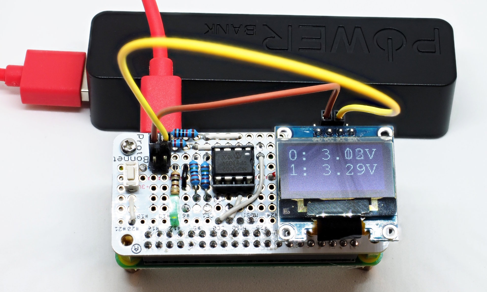

A two-channel DIY pHat for the Pi-Zero
======================================

This hardware/software project creates a two-channel ADC pHat for the
Pi-Zero. Note that it won't be a *real* pHat, because it is missing
the eeprom, but it uses the formfactor.

Hardware
--------

The circuit uses the following components:

  - Adafruit Perma Proto Bonnet Mini Kit  
    (https://www.adafruit.com/product/3203)
  - MCP3002 two-channel ADC (10 bit) connected to the SPI-bus
  - DIL-8 socket for the MCP3002
  - one green LED
  - one button (start/stop of measurement)
  - I2C mini-OLED display based on the SSD1306-chip
  - two 10k ohm resistors (for the voltage-dividers)
  - two 15k ohm resistors (for the voltage-dividers)
  - one 100 ohm resistor

Schematic
---------

The schematic:

  **to come**

Note the two voltage-dividers used for the two analog channels of the
MCP3002. Since our reference voltage is 3.3V, the voltage-dividers extend
the measurement range to 5.5V.

On a breadboard, this looks somewhat messy:

We use the **Perma Proto Bonnet Mini Kit** to create a pluggable pHat for
the Pi-Zero:

Wireing is best seen using the Fritzing view of the bonnet:

Software
--------

The software is implemented in python3. To install the software and it's
dependencies, run

    git clone https://github.com/bablokb/pi-adc-phat.git
    cd pi-adc-phat
    sudo tools/install

The install command will also configure SPI and I2C, if not already done.
Note that you must restart your Pi if SPI or I2C is newly activated.

Usage
-----

The installation-script configures a systemd-service for the reader
program. As soon as the LED is on, you can start and stop the measurement
using the push-button.

To disable this system-service at startup execute the command

    sudo systemctl disable pi-adc-phat.service

Now you can start the reader-program manually (e.g. from a ssh-shell):

    /usr/local/sbin/adc_read.py [filename|-]

If you pass a filename (or "-" for standard-output) the
measurements will also be appended to the argument file (or dumped to
the console in the latter case).

LED-States
----------

The LED uses the following states:

| State | Description           | Action on button pressed |
|-------|-----------------------|--------------------------|
| On    | ready                 | starts measurement       |
| blink | measurement is active | stops  measurement       |

